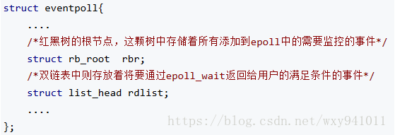
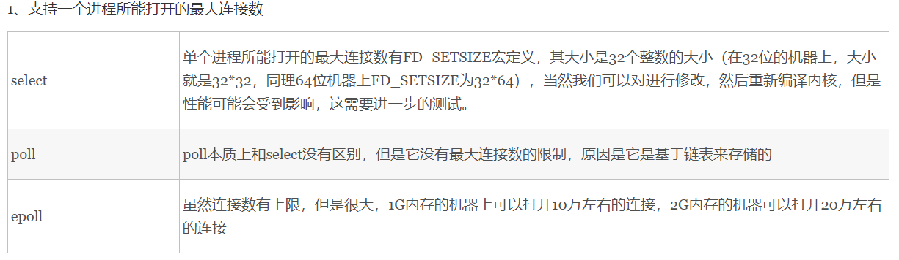
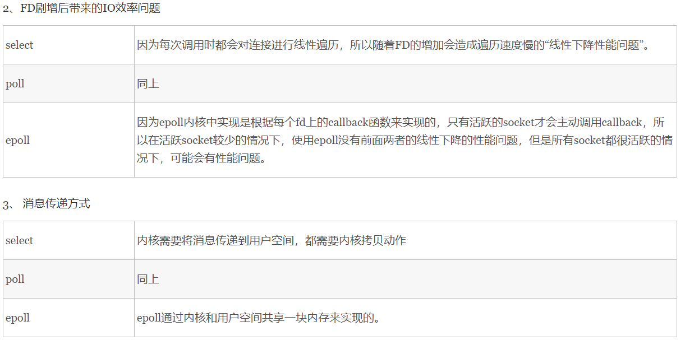
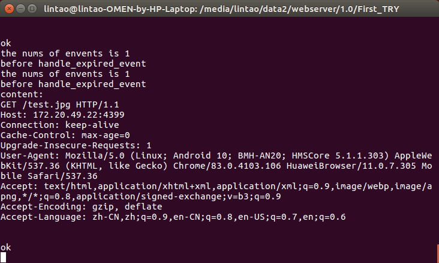

#一、服务器的io模型：
* 1.启动：

​		服务器启动之后，首先创建一个监听socket，然后讲其绑定服务器预设的端口上（比如4399）。

调用listen函数等待客户连接。

​		核心代码代码：

​    		
​			int sockfd =  0;
​    
    		if (( sockfd = socket(AF_INET, SOCKET_STREAM, 0) == 1)
    
    ​		{
    
    ​				return 1;
    
    ​		}
    
    ​		int optval = 1;
    
    ​		if( (setsockopt (sockfd, SOL_SOCKET, SO_REUSERADDR, &optval, 1 )) == 1)
    
    ​		{
    
    ​					return -1;
    
    ​		}
    
    ​		struct sockaddr_in server_addr;
    
    ​		bzero(static_cast<char*>(& server_addr), sizeof(server_addr));
    
    ​		server_addr.sin_family = AF_INET;
    
    ​		server_addr.sin_addr.s_addr = htonl(INADDR_ANY);
    
    ​		server_addr.sin_port = htons(PORT);
    
    ​		if(bind(sockfd,static_cast<struct sockaddr *>(server_addr) , sizeof(server_addr)) == -1)
    
    ​		{
    
    ​			return -1;
    
    ​		}
    
    ​		if(listen(sockfd, MAX_LISTENQUEUE_LENGTH) == -1)
    
    ​		{
    
    ​				return -1;

​		}

* 2.客户连接：

​		在服务器稳定的运行起来之后，客户就可以使用connect函数向服务器发起连接，因为客户的连接请求的随机到达的异步请求，所以服务器需要使用某种I/O模型来监听这一事件
76 .
* 3.服务器监听客户端的连接请求

# 二、服务器的IO复用

* 1 阻塞与非阻塞（主要针对服务器端），同步与异步（主要针对客户端）
同步与异步关注的是消息通信机制
	同步：客户端发出一个功能调用时，在没有得到结果之前，该调用就不会返回。比如，提交请求->等待服务器处理 -> 处理完毕返回 在这个过程中，客户端服务器不能做其他事情。
	异步： 当客户端发出一个异步过程调用时，调用者不能立刻得到结果，实际处理这个调用的函数在完成后，通过状态，通知，或者是回调来通知调用者

阻塞和非阻塞主要的指程序在等待系统调用时的状态。
    阻塞：调用结果返回之前，当前线程会被挂起，调用只有在得到结果才会返回。（一直在快递点睡觉，等着快递来了被唤醒）
	非阻塞：在不能立即得到结果之前，该调用不会阻塞当前进程，而会立刻返回。//采用忙轮询的方法，每个一段时间查询内核缓冲区，（每个五分钟看看快递有没有来），select通知调用者

* 2.select、poll、epoll

 epoll跟select都能提供多路I/O复用的解决方案。在现在的Linux内核里有都能够支持，其中epoll是Linux所特有，而select则应该是POSIX所规定，一般操作系统均有实现

### select：

用户线程发起请求的时候，首先会将socket添加到select中，这时阻塞等待select函数返回，当数据到达时，select被激活，select函数返回。此时用户线程才正式发起read请求，读取数据并继续执行。

从流程上来看，使用select函数进行IO请求和同步阻塞模型没有太大的区别，甚至还多了添加监视socket，以及调用select函数的额外操作，效率更差。但是，使用select以后最大的优势是用户可以在一个线程内同时处理多个socket的IO请求。用户可以注册多个socket，然后不断地调用select读取被激活的socket，即可达到在同一个线程内同时处理多个IO请求的目的。而在同步阻塞模型中，必须通过多线程的方式才能达到这个目的。

select本质上是通过设置或者检查存放fd标志位的数据结构来进行下一步处理。这样所带来的缺点是：

	1、 单个进程可监视的fd数量被限制，即能监听端口的大小有限。 一般来说这个数目和系统内存关系很大，具
	体数目可以cat /proc/sys/fs/file-max察看。32位机默认是1024个。64位机默认是2048.
	
	2、 对socket进行扫描时是线性扫描，即采用轮询的方法，效率较低：当套接字比较多的时候，
	每次select()都要通过遍历FD_SETSIZE个Socket来完成调度,不管哪个Socket是活跃的,都遍历一遍。
	这会浪费很多CPU时间。如果能给套接字注册某个回调函数，
	当他们活跃时，自动完成相关操作，那就避免了轮询，这正是epoll与kqueue做的。
	
	3、需要维护一个用来存放大量fd的数据结构，这样会使得用户空间和内核空间在传递该结构时复制开销大

### poll：

poll本质上和select没有区别，它将用户传入的数组拷贝到内核空间，然后查询每个fd对应的设备状态，如果设备就绪则在设备等待队列中加入一项并继续遍历，如果遍历完所有fd后没有发现就绪设备，则挂起当前进程，直到设备就绪或者主动超时，被唤醒后它又要再次遍历fd。这个过程经历了多次无谓的遍历。

它没有最大连接数的限制，原因是它是基于链表来存储的，但是同样有一个缺点：

  	1、大量的fd的数组被整体复制于用户态和内核地址空间之间，而不管这样的复制是不是有意义。
  	2、poll还有一个特点是“水平触发”，如果报告了fd后，没有被处理，那么下次poll时会再次报告该fd。

## epoll:
只有三个接口

###执行流程：
（1）.创建一个epoll描述符，调用epoll_create()来完成，epoll_create()有一个整型的参数size，用来告诉内核，要创建一个有size个描述符的事件列表（集合）：

当某一进程调用epoll_create方法时，Linux内核会创建一个eventpoll结构体，这个结构体中有两个成员与epoll的使用方式密切相关。eventpoll结构体如下所示：

int epoll_create(int size)

3）. 等待内核通知事件发生，得到发生事件的描述符的结构列表，该过程由epoll_wait()完成。得到事件列表后，就可以进行事件处理了。

int epoll_wait(int epfd, struct epoll_event * events, int maxevents, int timeout)

当调用epoll_wait检查是否有事件发生时，只需要检查eventpoll对象中的rdlist双链表中是否有epitem元素即可。如果rdlist不为空，则把发生的事件复制到用户态，同时将事件数量返回给用户。

epoll支持水平触发和边缘触发，最大的特点在于边缘触发，它只告诉进程哪些fd刚刚变为就需态，并且只会通知一次。还有一个特点是，epoll使用“事件”的就绪通知方式，通过epoll_ctl注册fd，一旦该fd就绪，内核就会采用类似callback的回调机制来激活该fd，epoll_wait便可以收到通知
epoll的优点：

1、没有最大并发连接的限制，能打开的FD的上限远大于1024（1G的内存上能监听约10万个端口）；

2、效率提升，不是轮询的方式，不会随着FD数目的增加效率下降。只有活跃可用的FD才会调用callback函数；
      即Epoll最大的优点就在于它只管你“活跃”的连接，而跟连接总数无关，因此在实际的网络环境中，Epoll的效率就会远远高于select和poll。

3、 内存拷贝，利用mmap()文件映射内存加速与内核空间的消息传递；即epoll使用mmap减少复制开销。

### 对比

### 总结：
综上，在选择select，poll，epoll时要根据具体的使用场合以及这三种方式的自身特点。

1、表面上看epoll的性能最好，但是在连接数少并且连接都十分活跃的情况下，select和poll的性能可能比epoll好，毕竟epoll的通知机制需要很多函数回调。

2、select低效是因为每次它都需要轮询。但低效也是相对的，视情况而定，也可通过良好的设计改善

## epoll分析
### 1.epoll结构体

    struct epoll_event结构分析

epoll_data是一个联合
    typedef union epoll_data {
    void *ptr;
    int fd;
    __uint32_t u32;
    __uint64_t u64;
    } epoll_data_t;
    
    struct epoll_event {
    __uint32_t events; /* Epoll events */
    epoll_data_t data; /* User data variable */
    };
    
    epoll_event结构体一部分是注册的事件，另一部分是存储数据的数据联合体。
    该data联合体一般用来传递参数。

### 2.epoll_wait

 int epoll_wait(int epfd, struct epoll_event * events, int maxevents, int timeout);
等待事件的产生，类似于select()调用。参数events用来从内核得到事件的集合，maxevents告之内核这个events有多大，这个 maxevents的值不能大于创建epoll_create()时的size，参数timeout是超时时间（毫秒，0会立即返回，-1将不确定，也有说法说是永久阻塞）。该函数返回需要处理的事件数目，如返回0表示已超时。如果返回–1，则表示出现错误，需要检查 errno错误码判断错误类型。

第1个参数 epfd是 epoll的描述符。

第2个参数 events则是分配好的 epoll_event结构体数组，epoll将会把发生的事件复制到 events数组中（events不可以是空指针，内核只负责把数据复制到这个 events数组中，不会去帮助我们在用户态中分配内存。内核这种做法效率很高）。

第3个参数 maxevents表示本次可以返回的最大事件数目，通常 maxevents参数与预分配的events数组的大小是相等的。

第4个参数 timeout表示在没有检测到事件发生时最多等待的时间（单位为毫秒），如果 timeout为0，则表示 epoll_wait在 rdllist链表中为空，立刻返回，不会等待。

## 三 HTTP请求处理模型

### 1.使用状态机分析接收到的http服务请求
（1）监听进程监听到epoll事件之后，遍历events数组里面的每一个事件，当遍历到一个事件时，新建一个requestData指针，指向events里面存的请求。新建一个文件描述符fd = request->getFd()
（2）检查是否是一个建立新连接的请求，如果是，则接受该连接，如果不是，说明这是一个http请求，释放该请求对象中的时间体，然后将该请求放在请求队列队尾，交给线程池处理。这里还要确认事件的正确性，如果是错误事件，应该delete这个请求。加入队列的是某一request的任务调用接口和该requestData
	
(3)线程池中的某一个线程对该http请求进行处理：首先定义一个缓冲区 char buff[MAX_BUFF = 4096],将是否出错这一状态置成false。然后在while(true)循环里进行数据读取：

    原因：对于ET模式下，如果read一次没有读尽buffer中的数据，那么下次将得不到读就绪的通知，造成
    buffer中已有的数据无机会读出，除非有新的数据再次到达。对于写操作，主要是因为ET模式下fd通常为非阻
    塞造成的一个问题——如何保证将用户要求写的数据写完。
    要解决上述两个ET模式下的读写问题，我们必须实现：
        a. 对于读，只要buffer中还有数据就一直读；
        b. 对于写，只要buffer还有空间且用户请求写的数据还未写完，就一直写。
用read进行读，如果返回的读取数小于零，代表出错，将错误位置零，跳出循环，如果读取数为0，并且errno = EGAIN（非阻塞中的常见错误），代表此时无数据可读，请稍后再试，此时++againTimes（定义在requestData中的私有变量），如果againTimes超过了AGAIN_MAX_TIMES = 200,则按出错处理。string now_read(buff, buff + num); content += now_read。content里面分析过的数据用完就删除了，然后如果没有分析到最后的状态，则一直等待后面读取进入新的数据。已经完成一个状态的分析后，会把分析结果放入从requestData对象，然后进入下一个状态，这里的设计很巧妙。
## 状态机：
使用手机浏览器请求服务器里面的某一图片资源得到以下结果，content:到ok之间是URI请求

state可以等于五个状态，出错则：跳到错误状态，delete这个requestData对象。以下只讨论未出错状态，出错的直接跳到err状态，子函数则直接返回错误类型。

	STATE_PARSE_URI：分析URI请求行:parse_URI()
	STATE_PARSE_HEADER：分析请求头部（用来说明服务器要使用的附加信息）
	STATE_RECV_BODY:这是post下动作
	STATE_ANALYSIS:get下直接有第二个状态转到该状态
	STATE_FINISH：
（1）_PARSE_URI:
该状态下首先find一个换行符'\r'。然后将字符串分成两个子字符串，字符串request_line为content的第一行数据，content为content除去第一行以外的数据

然后用find()方法查找"GET"，如果没找到，则查找POST，然后再method成员变量中记录。

下一步寻找 '/',找到寻找下一个空格的位置，然后读取这之间的文件名，存在file_name成员变量中，如果为空则保存默认文件名"index.html"。注意文件名中“？”后面的内容要切掉（？用来连接或者是避免读取缓存）

下一步'/'，读取http/后面的版本号，记录到HTTPversion成员变量中。
最后将状态置为 STATE_PARSE_HEADER
（2）_PARSE_HEADER:
该状态下是逐字符读取分析，有二级子状态，用成员变量h_state(头部状态表示)。
	h_start = 0: 表示开始读取，这是初始状态，如果没读到 ’\r‘ 或者 ’\n‘ ，存下key_start = i;读到 ’\r‘ 或者 ’\n‘ 时转到h_key状态
	h_key:一直读取到":"为止，存下key_end = i;,转到下一个状态h_colon(冒号)
	h_colon:读取到空格为止，转到下一个状态h_space_after_colon
	h_space_after_colon:z转到下一个状态h_value,value_start = i;
	h_value:读到’\r‘为止。转到下一个状态h_CR，value_end = i;分析value_end - value_starts是否取值在(0,255],超出范围，返回头部分析错误。
	h_CR:一直读到'\n'为止，然后转到下一个状态h_LF，此时读取key和value存入headers[key] =value,备用
	h_LF:如果读到'\r'，状态转为h_end_CR(此时说明下一行已经没有内容了),否则重新回到h_key状态（读取下一组key_value），并且key_start = i重定向key开始的位置;
	h_end_CR:如果读到'\n',转到下一个状态h_end_LF，否则返回错误
	h_end_LF:not_finish置为false，key_start置为i。跳出循环

循环外，如果状态是h_end_LF,返回分析成功，否则删去已经读取过的部分，返回PARSE_HEARDER_AGAIN（该状态与STATE_FINISH状态的区别在于要不要重置reset该requestData）。

注：linux下’\r‘：回到当前行开始位置。 ’\n‘：移到下一行，纵坐标不变。

’\r'仅仅是回车，控制屏幕是从键盘的Enter键输出，而另一个是换行，控制打印机

(3)STATE_RECV_BODY 
	寻找“Content_length"字符串，并且存下成员变量content_length 的值，进入STATE_ANALYSIS状态

(4)STATE_ANALYSIS
	①该方法要要先定义一个char header[MAX_BUFF]的字符数组，然后首先：
	sprintf(header, "HTTP/1.1 %d %s\r\n", 200, "OK");

	②然后根据之前分析的头部中connection是否是：keep_alive来确定选择长连接还是短连接，
	长连接需要sprintf(header,"%sConnection: Keep-alive\r\n",header);
	并且设定超时等待时长EPOLL_WAIT_TIME = 500us。
	sprintf(header,"%sKeep-ALive：timeout=%d\r\n",header,EPOLL_WAIT_TIME);
	
	③分析文件名，如果文件名中有.则读取MimeType中的相对于的文件名字。否则读取“default”
	
	④定义一个文件（夹）信息结构体 stat_t sbuf

​	
​	
​	

### 2.接收连接的处理流程
	(1)设置成非阻塞连接。
	(2)新建一个requestData对象
	(3)将该连接放入epoll_fd监听集合中，这一步要注册成脉冲触发:EPOLLIN | EPOLLET | EPOLLONESHOT.最后一个保证同一个socket，对于一种类型的请求，只能触发一个，防止多线程处理同一个socket上的事件。
	(4)在epoll_fd上注册该socket事件时，要新建一个epoll_event结构体，在该结构体中放入监听的事件类型和epoll_data.ptr = requestData对象。
	(5)新建一个时间信息对象MyTimer，放入requestData对象，用来处理超时事件。
	(6)取得时间堆的锁，qlock，加锁，然后将该时间信息对象放入时间堆，然后解锁。

###3 重置requestData
	重置除HTTPversion epoll_fd，fd之外的所有成员变量
## 四 线程池

### 1.线程池对象
线程池被封装成了一个对象，成员变量有一个互斥锁，一个互斥锁的条件变量，一个存储子线程的线程数组，一个存储待执行任务的数组，该数组的大小是恒定的，为定义的MAX_QUEUE = 65535，通过几个记录的int型变量来实现队列的功能：thread_count表示线程总数，queue_size是队列大小，head队列执行的头，当前执行位置，tail是队列的尾，表示执行到哪个位置，started表示已经开始的线程数，shutdown表示是否要关闭该线程池，有快速关闭和慢关闭两种方式,该变量也用来防止重复关闭
### 2.线程池的关闭
threadpool_destroy()表示正常情况下的关闭。threadpool_free()是异常情况下的关闭：包括创建线程池失败时，正常关闭线程池失败时这两种情况，本质上threadpool_free只是释放了threadpool结构体中的所有资源。free(pool->thread 和 pool->queue),然后释放互斥锁，最后free该线程池对象pthread_mutex_destroy(pool->lock)和 pthread_cond_destroy(pool->notify)。`notify是一个pthread_cond_t 类型

pthread_cond_t是一个条件变量，用来和pthread_mutex_t配合使用，可以解决消费者生产者问题中的死锁。
死锁：0，-> 进入临界区-> 发现共享资源n不足以满足继续执行的条件（n > 0）-> 一直等待，但是没有释放互斥锁。此时生产者进程无法拿到互斥锁，无法进入临界区，无法修改n的值，生产者等待消费者释放互斥锁，死锁发生。

`临界区：对共享内存进行访问的程序片段
因此使用条件变量解决死锁问题。

thread_destroy()首先获得互斥锁，然后修改shutdown标志位，如果取1:gracefuldown则线程池里的每一个线程会等待任务执行完毕之后跳出循环，结束执行;如果取immediate_shutdown则线程立即跳出循环，结束执行，修改完成之后释放互斥锁。然后使用，最后逐个用pthread_join()关闭线程池里的每一个线程，如果这些步骤执行异常就调用threadpool_free()

### 3.线程池创建线程时运行的函数
threadpool_thread(void* threadpool),该函数传入的参数就是线程池本身，然后定义一个thread_task_t类型的结构体，该结构体存储pool的线程队列中，从队列中取出循环时，要先取得互斥锁，每个线程的等待条件为：
pool->count == 0 && !pool->down 满足该条件的话，该线程就会一直等待在这个while循环中。

而存储在线程池队列中的就是requestData请求，通过它的接口函数和该requestData对象来调用请求处理函数

##主函数处理流程
## Reactor模式
reactor模式要求主线程只负责监听文件描述符上是否有事件发生，有的话就立即把该事件通知工作线程，除此之外，主线程不做任何其他有实质性的工作，读写数据，接受新的连接，以及处理客户请求均在工作线程中完成。

使用同步I/O模型(以epoll_wait为例)实现的Reactor模式的工作流程是：
（1）主线程往epoll内核事件表中注册socket上的读就绪事件
（2）主线程调用epoll_wait等待socket上有数据可读。
（3）当socket上有数据可读时，epoll_wait通知主线程，然后主线程将socket可读事件放入请求队列
（4）睡眠在请求队列上的某个工作线程被唤醒，该线程从socket上读取数据，并且处理用户请求，往epoll内核事件表上注册该socket上的写就绪事件
（5）主线程调用epoll_wait等待socket可写
（6）当socket可写时，epoll_wait通知主线程，主线程将socket可写事件放入请求队列。
（7）睡眠在请求队列上的某个工作线程被唤醒，它往socket上写入服务器处理客户请求的结果。

## 半同步/半反应堆模式

异步线程只有一个，由主线程来充当，它负责监听所有socket上的事件，如果监听socket上有可读事件发生，即有新的连接请求到来，主线程就接收以得到新的连接socket，然后往epoll内核事件表中注册该socket上的可读事件。

如果socket上有读写事件发生，就将该连接插入请求队列中，所有的工作线程都睡眠在请求队列上，当任务到来时，他们将通过竞争(比如争夺互斥锁的控制权)获得任务的接管权。这种竞争机制使得只有空闲的工作线程才有机会来处理新任务。

​	
​	